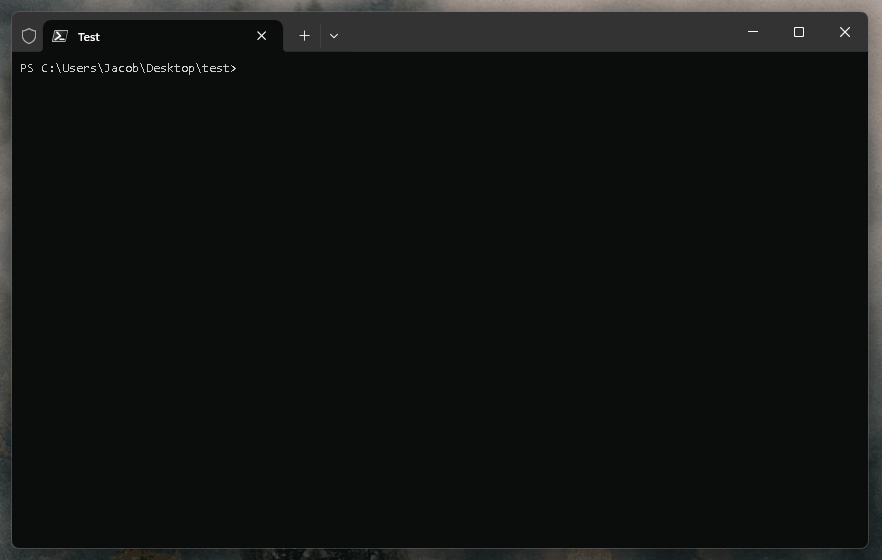

# TSpew

A simple template printer for the JavaScript console.

### Install

```
npm install tspew
```

### Example Usage

Create a `template` file in the root of your project

```
touch template
```

Build your template using built in replacers or you can supply your own later, you can even use hex colours!

```
%hex[473cc2] _____                           _        _____                    _       _
| ____|_  ____ _ _ __ ___  _ __ | | ___  |_   _|__ _ __ ___  _ __ | | __ _| |_ ___
|  _| \ \/ / _` | '_ ` _ \| '_ \| |/ _ \   | |/ _ \ '_ ` _ \| '_ \| |/ _` | __/ _ \
| |___ >  < (_| | | | | | | |_) | |  __/   | |  __/ | | | | | |_) | | (_| | ||  __/
|_____/_/\_\__,_|_| |_| |_| .__/|_|\___|   |_|\___|_| |_| |_| .__/|_|\__,_|\__\___|
                          |_|                               |_|                    %reset
Node Version: %fgGreen20.12.0%reset
Port: %fgGreen3000%reset

```

Call the template printer whenever you want to, for example when an express app starts

```
import express from "express";
import printTemplate from "tspew";

const app = express();

app.listen(3000, () => {
  printTemplate({ lineDelay: 20 });
});
```


